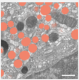

# StarDist Model Training Solution for Album

## Introduction
This is an album solution designed to train a StarDist model directly from the command line. The primary goal of this solution is to facilitate the training of models to segment structures using the StarDist approach.

Please refer to the detailed documentation of [StarDist](https://github.com/stardist/stardist) for in-depth understanding and guidelines.

<details>
  <summary><h2>Example: Training a 3D StarDist Model for Secretory Granules Segmentation</h2></summary>



The purpose of this example is to guide users on training a StarDist model to segment secretory granules from 3D FIB-SEM data. The training procedure and its significance are elaborated in the paper:

Müller, Andreas, et al. "3D FIB-SEM reconstruction of microtubule–organelle interaction in whole primary mouse β cells." Journal of Cell Biology 220.2 (2021).

### Dataset Preparation
Download the sample data (or you can prepare your own data in a similar format).
```bash
wget https://syncandshare.desy.de/index.php/s/5SJFRtAckjBg5gx/download/data_granules.zip
unzip data_granules.zip
```

After extracting, your data should be structured as follows:

```bash
data_granules
├── train
│   ├── images
│   └── masks
└── val
    ├── images
    └── masks
```
</details>

## Installation
Make sure album is already installed. If not, download and install it as described [here](https://album.solutions/).
Also, don't forget to add the catalog to your album installation, so you can install the solutions from the catalog.

Install the `stardist_train` and `stardist_predict` solution by using the graphical user interface (GUI) of album or by running the following command in the terminal:
```bash
album install io.github.betaseg:stardist_train:0.1.0
album install io.github.betaseg:stardist_predict:0.1.0
```

## How to use
<details>
  <summary><h2>Training</h2></summary>
To start the training process, provide the root directory of the data (using the "root" argument) and the desired output directory (using the "out" argument). By default, the solution will train a 3D stardist model for 100 epochs.

The parameters can be set and run using either the GUI, or by adapting this example for command line usage:
```bash
album run stardist_train --root /data/stardist_train/data_granules --out /data/stardist_train/data_granules_out --epochs 10 --steps_per_epoch 15
```

During training, a _TensorBoard_ will be opened in your browser. You can monitor the training process and the model performance using the _TensorBoard_. The solution terminates when the training is finished and _TensorBoard_ is closed.

The trained model will be saved in the specified output directory and contains the date and time of the run. The model can be used for inference using the `stardist_predict` solution.
</details>

<details open>
  <summary><h2>Predict</h2></summary>
For inference, provide the path to an input file (TIF) or directory containing multiple files (TIF) using the `fname_input` argument. 
State the `model_name` and its corresponding directory `model_dir`.  
The output directory must be specified using the `output_dir` argument. 

```bash
album run stardist_predict --fname_input /data/stardist_train/data_granules/val/images/high_c1_raw_region_2.tif --model_name 2023_06_28-17_45_35_stardist --model_basedir /data/stardist_train/data_granules_out/ --output_dir /data/stardist_train/predictions
```
</details>

### Further documentation: 
For further options, parameters and default values, please refer to the info page of the solution:
```bash
album info stardist_predict
```

## Hardware Requirements
Ensure that your hardware meets the specific requirements of [StarDist](https://stardist.net/docs/faq.html#what-hardware-do-you-recommend) for efficient training. For training a 3D model, we recommend to use a GPU with at least 8GB of memory.

## Citation & License
Stardist is licensed under the [BSD 3-Clause License](https://github.com/stardist/stardist/blob/master/LICENSE.txt).

If you use this solution, please cite the following paper:
```
title: Cell Detection with Star-Convex Polygons,
doi: 10.1007/978-3-030-00934-2_30
```
and
```
title: Star-convex Polyhedra for 3D Object Detection and Segmentation in Microscopy,
doi: 10.1109/WACV45572.2020.9093435
```
