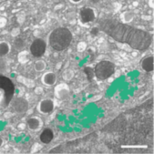

# CSBDeep unet train album solution

This album solution uses the CSBDeep toolbox to train a UNET model from the command line.

## documentation

The extensive documentation of CSBDeep can be found at http://csbdeep.bioimagecomputing.com/doc/.

## Example: 3D segmentation of golgi aparatus with 3D U-Net

This demonstrates how to use the solution to train a 3D U-Net model to perform semantic segmentation of the golgi
aparatus from 3D FIB-SEM data.
The procedure is described in the paper:

Müller, Andreas, et al. "3D FIB-SEM reconstruction of microtubule–organelle interaction in whole primary mouse β cells."
Journal of Cell Biology 220.2 (2021).

Download the example data (or adapt your own data into the same format)

wget https://syncandshare.desy.de/index.php/s/FikPy4k2FHS5L4F/download/data_golgi.zip
unzip data_golgi.zip
which should result in the following folder structure:

data_golgi
├── train
│ ├── images
│ └── masks
└── val
├── images
└── masks

Call the solution by only providing the root folder of the data to reproduce the results of the paper.

## reproducable call
album run io.github.betaseg:csbdeep_unet_predict:0.1.0 
    --model /path/to/my_model 
    --input /path/to/my_input
    --outdir /path/to/my_output