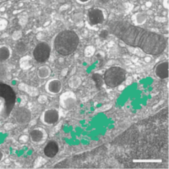

# CSBDeep Segmentation Solution for Album
## Introduction
This album solution uses the CSBDeep toolbox to train a U-NET model to perfom segmentations from the command line.

The extensive documentation of CSBDeep can be found at http://csbdeep.bioimagecomputing.com/doc/.

This solution consists of two parts:
1. CSBDeep-train: This solution is used to train the model
2. CSBDeep-predict: This solution is used to perform inference/prediction.


## Example: 3D segmentation of golgi aparatus with 3D U-Net



This demonstrates how to use the solution to train a 3D U-Net model to perform semantic segmentation of the golgi aparatus from 3D FIB-SEM data 
The procedure is described in the paper:

Müller, Andreas, et al. "3D FIB-SEM reconstruction of microtubule–organelle interaction in whole primary mouse β cells." Journal of Cell Biology 220.2 (2021).

Download the example data (or adapt your own data into the same format)

```bash
wget https://syncandshare.desy.de/index.php/s/FikPy4k2FHS5L4F/download/data_golgi.zip
unzip data_golgi.zip
```
which should result in the following folder structure:

```bash
data_golgi
├── train
│   ├── images
│   └── masks
└── val
    ├── images
    └── masks
```

## Installation
Make sure album is already installed. If not, download and install it as described [here](https://album.solutions/).
Also, don't forget to add the catalog to your album installation, so you can install the solutions from the catalog.

Install the `CSBDeep-train` solution by using the graphical user interface (GUI) of album or by running the following command in the terminal:
```bash
album install io.github.segmentation:CSBDeep-train:0.1.0
```

For prediction, install the `CSBDeep-predict` solution:
```bash
album install io.github.segmentation:CSBDeep-predict:0.1.0
```

## How to use
<details open>
  <summary><h2>CSBDeep-train</h2></summary>

To run the training, set the parameters in the GUI or adapt this example for command line usage:
```bash
conda activate album
album run csbdeep_unet_train --root /data/csbdeep_unet_train/data_golgi --epochs 3 --steps_per_epoch 5
```

During training, a browser tab opens and shows the training progress. The program terminates after the training is finished and the tab is closed. 
</details>

<details>
  <summary><h2>CSBDeep-predict</h2></summary>

To perform inference/prediction, set the parameters in the GUI or adapt this example for command line usage:
```bash
conda activate album
album run csbdeep_unet_predict --input /data/csbdeep_unet_train/data_golgi/val/images --outdir /data/segmentations --model /models/2023_07_04-15_06_33_unet
```

For further options and default values, please refer to the corresponding info page of the solution:
```bash
album info csbdeep_unet_predict
```
</details>

### Further documentation: 
For further options, parameters and default values, please refer to the info page of the solution:
```bash
album info csbdeep_unet_predict
```

## Hardware requirements
We recommend to use a GPU with at least 8GB of memory to run the solution as a minimum requirement.

## Citation & License
This solution is licensed under the BSD 3-Clause License.

If you use this solution, please cite the following paper:
```
doi: 10.1038/s41592-018-0216-7,
title: Content-aware image restoration: pushing the limits of fluorescence microscopy
```
