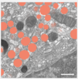

# StarDist train album solution

This album solution can be used to train a StarDist model from the command line.

## documentation

The extensive documentation of StarDist can be found at https://github.com/stardist/stardist.

## Example: 3D segmentation of secretory granules with 3D stardist

This demonstrates how to use this solution to train a Stardist model to segment secretory granules from 3D FIB-SEM data.
The procedure is described in the paper:

Müller, Andreas, et al. "3D FIB-SEM reconstruction of microtubule-organelle interaction in whole primary mouse β cells." Journal of Cell Biology 220.2 (2021).

Download the example data (or adapt your own data into the same format)

wget https://syncandshare.desy.de/index.php/s/5SJFRtAckjBg5gx/download/data_granules.zip
unzip data_granules.zip
which should result in the following folder structure:

data_granules
├── train
│   ├── images
│   └── masks
└── val
    ├── images
    └── masks

Start the solution by only providing the root folder of the data (argument named "root")
and the output folder (argument named "out") to reproduce the results of the paper. 
This way the solution trains a 3D stardist model for 100 epochs.

## reproducable call
album run io.github.betaseg:stardist_train:0.1.0 --root path/to/granules --out path/to/granules_results 

